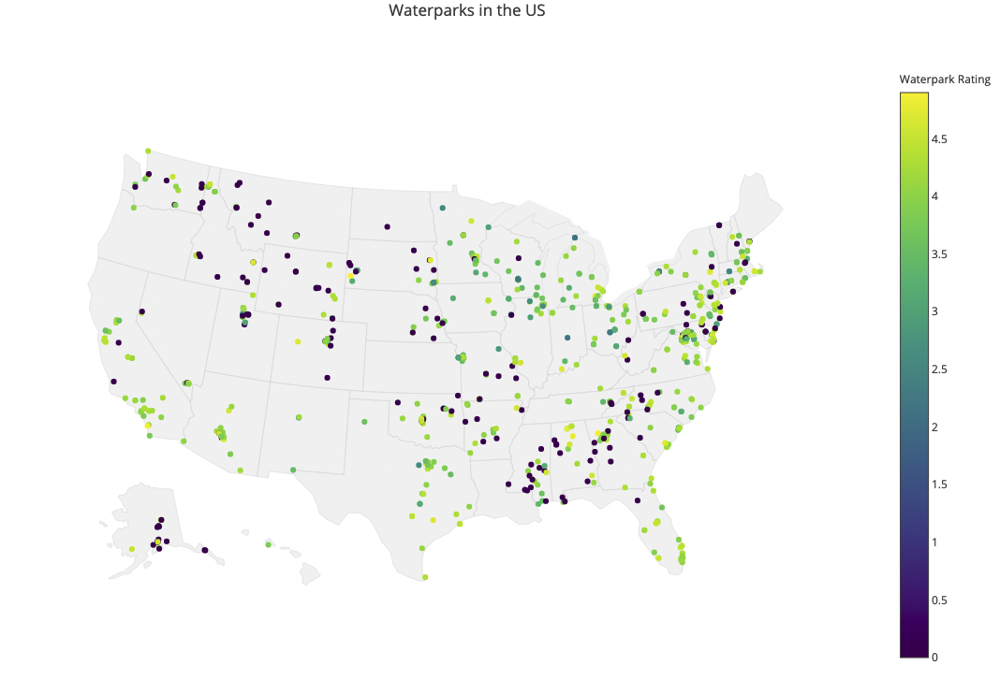

I've got a buddy who manages and builds waterparks. I thought to myself... *I am probably the only person in the world who has a friend that works at a waterpark - cool*. Then I started thinking some more... *there has to be more than just his waterpark in this country; I've been to at least a few*... and the thinking continued... *I wonder how many there are*... and continued... *and I wonder where they are*... and, well, here we are at the culmination of that curiosity with this blog post.

So - the first problem - how would I figure that out? As with most things I need 
answers to in this world, I turned to Google and asked: 
[Where are the waterparks in the US?](https://www.google.com/maps/search/water+parks+in+the+US/@36.1121754,-100.6663344,4z/data=!3m1!4b1) 
The answer appears to be: there are a lot. The data is there if I can get my 
hands on it.

Knowing that Google has an API, I signed up for an API key and away I went! Until 
I was stopped abruptly with limits on how many results will be returned: a measly 
20 per search.

I know R and wanted to use that to hit the API. Using the httr package and a for 
loop, I conceded to doing the search once per state and living with a maximum 
of 20 results per state. Easy fix. Here's the code to generate the search string 
and query Google:

```{r snippet, eval = FALSE}
q1 <- paste("waterparks in ", list_of_states[j,1], sep = "")

response <- GET("https://maps.googleapis.com/", 
                path = "maps/api/place/textsearch/xml", 
                query = list(query = q1, key = "YOUR_API_KEY"))
```

The results come back in XML (or JSON, if you so choose... I went with XML for 
this, though) - something that I have not had much experience in. I used the XML 
package and a healthy amount of more time in Google search-land and was able to 
parse the data into data frame! Success! Here's a snippet of the code to get 
this all done:

```{r snippet2, eval = FALSE}
result <- xmlParse(response)
result1 <- xmlRoot(result)
result2 <- getNodeSet(result1, "//result")

data[counter, 1] <- xmlValue(result2[[i]][["name"]])
data[counter, 2] <- xmlValue(result2[[i]][["formatted_address"]])
data[counter, 3] <- xmlValue(result2[[i]][["geometry"]][["location"]][["lat"]])
data[counter, 4] <- xmlValue(result2[[i]][["geometry"]][["location"]][["lng"]])
data[counter, 5] <- xmlValue(result2[[i]][["rating"]])
```

Now that the data is gathered and in the right shape - what is the best way to 
present it? I've recently read about a package in R named plotly. They have many 
interesting and interactive visualizations, plus the API plugs right into R. I 
found a nice example of a map using the package. With just a few lines of code 
and a couple iterations, I was able to generate this (click on the picture to 
get the full interactivity):



This plot can be seen [here](https://plot.ly/~rozran00/61), too.

Not too shabby! There are a few things to mention here... For one, not every 
water park has a rating; I dealt with this by making the NAs into 0s. That's 
probably not the nicest way of handling that. Also - this is only the top 20 
waterparks as Google decided per state. There are likely some waterparks out 
there that are not represented here. There are also probably non-waterparks 
represented here that popped up in the results.

For those of you who are interested in the data or script I used to generate 
this map, feel free to grab them at those links. Maybe one day I'll come back to 
this to find out where there are the most waterparks per capita - or some other 
correlation to see what the best water park really is... this is just the tip of 
the iceberg.

It feels good to scratch a few curiosity driven scratches in one project!