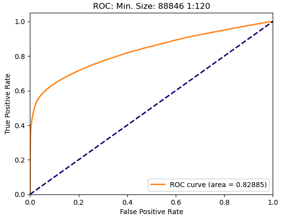
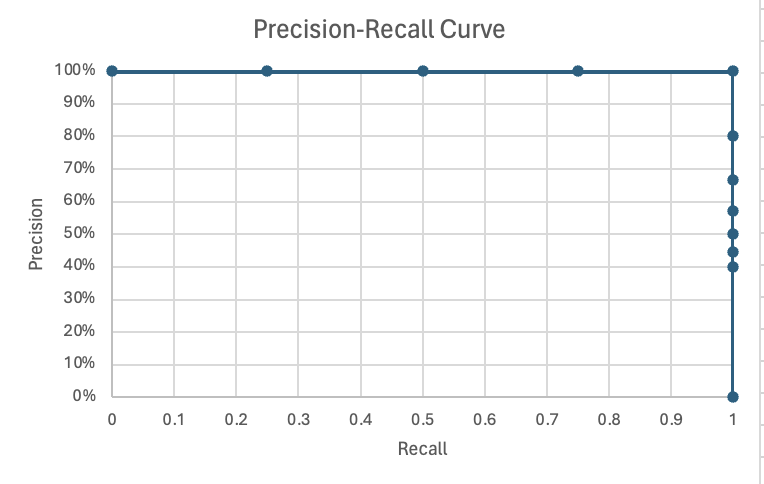

How you measure a model matters - this is probably very obvious. How else would 
you know your model is better than the last version if you didn't have 
measurements? Two common ways to model overall model effectiveness are the 
**Area Under the Curve (AUC)** of the 
**Receiver Operating Characteristics (ROC)** Curve and the AUC of the 
**Precision-Recall Curve (PRC)**. 

To just look at those acronyms (and there will be more), it is easy to get lost 
in the lingo and go comatose. Let's break it down.

But first.... 

## Some Background (and more Acronyms)

Before we even get into metrics, in **machine learning** (also known as 
**predictive analytics** or **AI** or **ML** or a number of other things 😳), 
practitioners will refer to **classes**, which are just groups in our data. 

In our classification models, we have two classes. These are usually things like 
fraud/not fraud, recommend/don't recommend, will default on loan/won't default 
on loan, etc. 

1. Target class (what you are trying to predict)
	1. In an imbalanced dataset, this is also referred to as the 
	**minority class**1
	2. Also referred to as the **positive class**
2. The other "normal" class
	1. In an imbalanced dataset, this is also referred to as the 
	**majority class**1
	2. Also referred to as the **negative class**

_**1**: Why minority and majority? Well... in an **imbalanced dataset** you have _
_way MORE observations normal class than in your target class... like... _
_sometimes WAY WAY WAY more. Maybe 1MM observations that aren't fraud, for _
_example, to every observation that could be._

These two classes, where we have both the actual class (what we observe in the 
wild) and the predicted class (what the model thought it would be), are the 
basis of measuring model performance. 

### Basic Modeling Metrics

When you are building predictive models, there are four questions to consider:

1. How often did your model predict the thing you are predicting? 
	1. This is called a **true positive (TP)**
	2. If you are trying to predict fraud: your model predicts the customer was 
	fraudulent and they were fraudulent
2. How often did your model wrongly predict the thing you are predicting?
	1. This is called a **false positive (FP)**
	2. If you are trying to predict fraud: your model predicts the customer was 
	fraudulent and they were a regular customer not committing fraud
3. How often did your model miss the thing you are trying to predict?
	1. This is called a **false negative (FN)**
	2. If you are trying to predict fraud: your model predicts the customer was 
	normal and they were fraudulent (they get away with the goods)
4. How often does your model predict the negative class correctly?
	1. This is called a **true negative (TN)**
	2. If you are trying to predict fraud: your model predicts the customer was 
	normal and they were good

### Confusion Matrix

Based on those four metrics, data scientists create a **confusion matrix**, 
which is just a confusing name for putting those four values into a table.

Keep a mental note of this confusion matrix. We are going to come back to this 
to in a section or two to create additional metrics (metrics from metrics - 
like in Inception where they create a dream inside of a dream, and of equal 
mind-f\*ck quality). 

We have enough information with this, though, to look at the ROC Curve

## Here's Looking at you, ROC Curve

Well... what is a ROC Curve? In short, it tell's a data scientist how well a 
model separates the classes. In a perfect world, the Area Under the Curve (AUC) 
or a ROC Curve is 1 (values range from 0 to 1). When AUC is 1, the model is 
perfectly separating the classes. This is unusual, but let's look at an example. 
The ROC Curve (image below) shows the True Positive Rate (y-axis) by the False 
Positive Rate (x-axis). 

[Image Credit: Wikipedia](https://upload.wikimedia.org/wikipedia/commons/thumb/1/13/Roc_curve.svg/1920px-Roc_curve.svg.png)

### The Perfect ROC Curve

To calculate the data for a ROC curve, we first have to take our data and make a prediction. 

| Observation | Actual   | Prediction  |
| ----------- | -------- | ----------- |
| 1           | Fraud | 0.748078516 |
| 2           | Fraud | 0.944673621 |
| 3           | Fraud | 0.503556653 |
| 4           | Good Customer    | 0.174186664 |
| 5           | Good Customer    | 0.036683147 |
| 6           | Good Customer    | 0.452495944 |
| 7           | Good Customer    | 0.117337229 |
| 8           | Fraud | 0.593860392 |
| 9           | Good Customer    | 0.482503257 |
| 10          | Good Customer    | 0.457706555 |

We then sort our data by the prediction we made. 

| Observation | Actual   | Prediction  |
| ----------- | -------- | ----------- |
| 2           | Fraud | 0.944673621 |
| 1           | Fraud | 0.748078516 |
| 8           | Fraud | 0.593860392 |
| 3           | Fraud | 0.503556653 |
| 9           | Good Customer    | 0.482503257 |
| 10          | Good Customer    | 0.457706555 |
| 6           | Good Customer    | 0.452495944 |
| 4           | Good Customer    | 0.174186664 |
| 7           | Good Customer    | 0.117337229 |
| 5           | Good Customer    | 0.036683147 |

In the table above, where the prediction is descending order, we see that the 
classes are perfectly sorted. This gives us the ROC AUC of 1, but let's see how. 

To calculate each point in the ROC Curve, we step through the table cumulatively 
calculating the True Positive Rate and False Positive Rate.

#### Step 1

| Observation | Actual   | Prediction  | Total True Positives | True Positives | True Positive Rate | Total True Negatives | False Positives | False Positive Rate |
| ----------- | -------- | ----------- | -------------------- | -------------- | ------------------ | -------------------- | --------------- | ------------------- |
| 2           | Fraud | 0.944673621 | 4                    | 1              | 25%                | 6                    | 0               | 0%                  |

This is the first row of the table. 

- In each step of the ROC calculations we assume that every prediction should be 
`TRUE`; in this case, `TRUE` means "Fraud"
- In this step, there is 1 observation
- The calculation is assuming this observation should be "Fraud" and that is 
what was predicted here:
	- Our True Positive Rate (TPR)2  is $\dfrac{1}{4}=0.25=25\%$
	- Our False Positive Rate (FPR)3 is $\dfrac{0}{6}=0=0\%$. 
- These values - (0, 0.25) - become the first point in our ROC graph. 

***2**: $TPR = \dfrac{TP}{Total_{TP}}$* 
***3**: $FPR = \dfrac{FP}{Total_{TN}}$* 

#### Step 2

| Observation | Actual   | Prediction  | Total True Positives | True Positives | True Positive Rate | Total True Negatives | False Positives | False Positive Rate |
| ----------- | -------- | ----------- | -------------------- | -------------- | ------------------ | -------------------- | --------------- | ------------------- |
| 2           | Fraud | 0.944673621 | 4                    | 1              | 25%                | 6                    | 0               | 0%                  |
| 1           | Fraud | 0.748078516 | 4                    | 2              | 50%                | 6                    | 0               | 0%                  |
This is the first two rows of the table. 

- In this step, there are 2 observations
- The calculation is assuming both observations should be "Fraud" and that 
is what was predicted here:
	- Our True Positive Rate (TPR)  is $\dfrac{2}{4}=0.50=50\%$
	- Our False Positive Rate (FPR) is $\dfrac{0}{6}=0=0\%$. 
- These values - (0, 0.50) - become the second point in our ROC graph. 

#### Step 10

| Observation | Actual   | Prediction  | Total True Positives | True Positives | True Positive Rate | Total True Negatives | False Positives | False Positive Rate |
| ----------- | -------- | ----------- | -------------------- | -------------- | ------------------ | -------------------- | --------------- | ------------------- |
| 2           | Fraud | 0.944673621 | 4                    | 1              | 25%                | 6                    | 0               | 0%                  |
| 1           | Fraud | 0.748078516 | 4                    | 2              | 50%                | 6                    | 0               | 0%                  |
| 8           | Fraud | 0.593860392 | 4                    | 3              | 75%                | 6                    | 0               | 0%                  |
| 3           | Fraud | 0.503556653 | 4                    | 4              | 100%               | 6                    | 0               | 0%                  |
| 9           | Good Customer    | 0.482503257 | 4                    | 4              | 100%               | 6                    | 1               | 17%                 |
| 10          | Good Customer    | 0.457706555 | 4                    | 4              | 100%               | 6                    | 2               | 33%                 |
| 6           | Good Customer    | 0.452495944 | 4                    | 4              | 100%               | 6                    | 3               | 50%                 |
| 4           | Good Customer    | 0.174186664 | 4                    | 4              | 100%               | 6                    | 4               | 67%                 |
| 7           | Good Customer    | 0.117337229 | 4                    | 4              | 100%               | 6                    | 5               | 83%                 |
| 5           | Good Customer    | 0.036683147 | 4                    | 4              | 100%               | 6                    | 6               | 100%                |

This is the full 10 rows of the table. 

- In this step, there are 10 observations
	- 4 total true positives
	- 6 total false positives
- The calculation is assuming both observations should be "Fraud" and that is 
what was predicted here:
	- Our True Positive Rate (TPR)  is $\dfrac{4}{4}=1.00=100\%$
	- Our False Positive Rate (FPR) is $\dfrac{6}{6}=1.00=100\%$. 
- These values - (1.00, 1.00) - become the last point in our ROC graph. 

### Drawbacks of the ROC - What is it Actually Measuring?

Actual ROC Curve: 

The ROC Curve is fully focused on the positive predictions and includes the 
True Negative count. In the case of fraud detection, positive predictions are a 
very small fraction of the world and True Negatives are a vast majority. It just 
doesn't make great analytical sense to assume at any point, as the ROC does, 
that our full sample should be classified as "Fraud." 

Long story, short: The ROC calculation is flattering AND accurate, but it is not 
sensitive to all changes in the model due to the inclusion of True Negatives and 
imbalance in the classes. 

## If not the ROC, then how about a Precision-Recall Curve?

There is another curve, though, that can help us evaluate and compare model 
performance. It is called the Precision-Recall Curve because, you guessed it, it 
plots the precision against the recall of a model! This curve, though, hides 
behind two technical terms and their corresponding equations, making them harder 
to comprehend. 

### Precision (y-axis)

$precision = \dfrac{TP}{TP + FP}$ 

where a True Positive (TP) means you were fraud and the model predicted you were 
fraud and a False Positive (FP) means you were a good customer and the 
prediction was that you were fraud. 

**What Precision is in English:** For every customer predicted as fraud, what 
percent of the time does the model get it correct? 

### Recall (x-axis)

$recall = \dfrac{TP}{TP + FN}$

where a True Positive (TP) means you were fraud and the model predicted you were 
fraud and a False Negative (FN) means you were fraud and the model predicted you 
were a good customer. 

**What Recall is in English:** For customer that was actually fraud, what 
percent of the time do we get it correct? 

Eyes glassing over? Yep. Me too.

### Bottom Line

As mentioned before, the True Negatives (those good people just buying products 
like normal good people do) are in neither calculation here. The 
Precision-Recall curve is much more sensitive to changes in positive predictions 
(we predict you are fraudulent) and the positive class (you actually are 
fraudulent).

### The PRC Example

Again, we are sorting our observations in descending order based on the model 
prediction. Going row-by-row, as we did with the ROC Curve, we are calculating 
the TP, FP, FN, Precision, and Recall assuming that the positive class is 
everything at the corresponding row and above. 

| Observation | Actual   | Prediction  | True Positives | False Positives | False Negatives | Precision | Recall |
| ----------- | -------- | ----------- | -------------- | --------------- | --------------- | --------- | ------ |
| 2           | Fraud | 0.944673621 | 1              | 0               | 3               | 100%      | 25%    |
| 1           | Fraud | 0.748078516 | 2              | 0               | 2               | 100%      | 50%    |
| 8           | Fraud | 0.593860392 | 3              | 0               | 1               | 100%      | 75%    |
| 3           | Fraud | 0.503556653 | 4              | 0               | 0               | 100%      | 100%   |
| 9           | Good Customer    | 0.482503257 | 4              | 1               | 0               | 80%       | 100%   |
| 10          | Good Customer    | 0.457706555 | 4              | 2               | 0               | 67%       | 100%   |
| 6           | Good Customer    | 0.452495944 | 4              | 3               | 0               | 57%       | 100%   |
| 4           | Good Customer    | 0.174186664 | 4              | 4               | 0               | 50%       | 100%   |
| 7           | Good Customer    | 0.117337229 | 4              | 5               | 0               | 44%       | 100%   |
| 5           | Good Customer    | 0.036683147 | 4              | 6               | 0               | 40%       | 100%   |

# Learning from the Metrics

While you never want to build a model exclusively to exceed in any 
non-real-world metric, understanding how these metrics work will lead your team 
to better understand the world you are modeling in. If your dataset is massively 
imbalanced, you frankly may not need to focus on the majority class. The vast 
majority of customers are not fraudulent and will not ever experience fraud. 