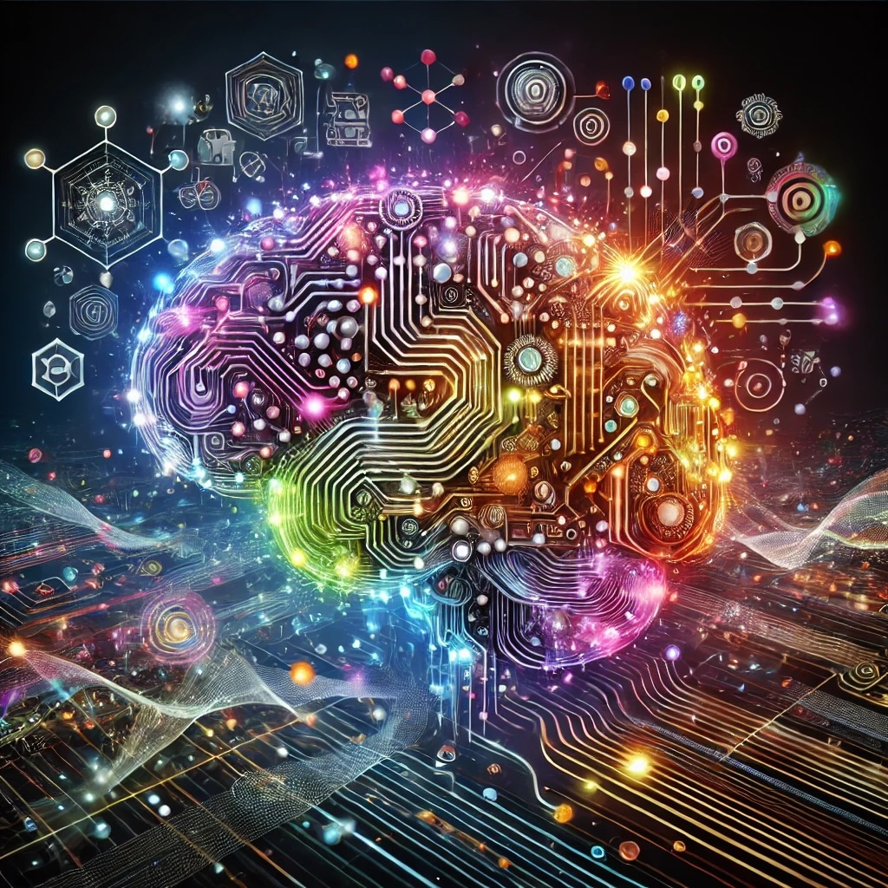
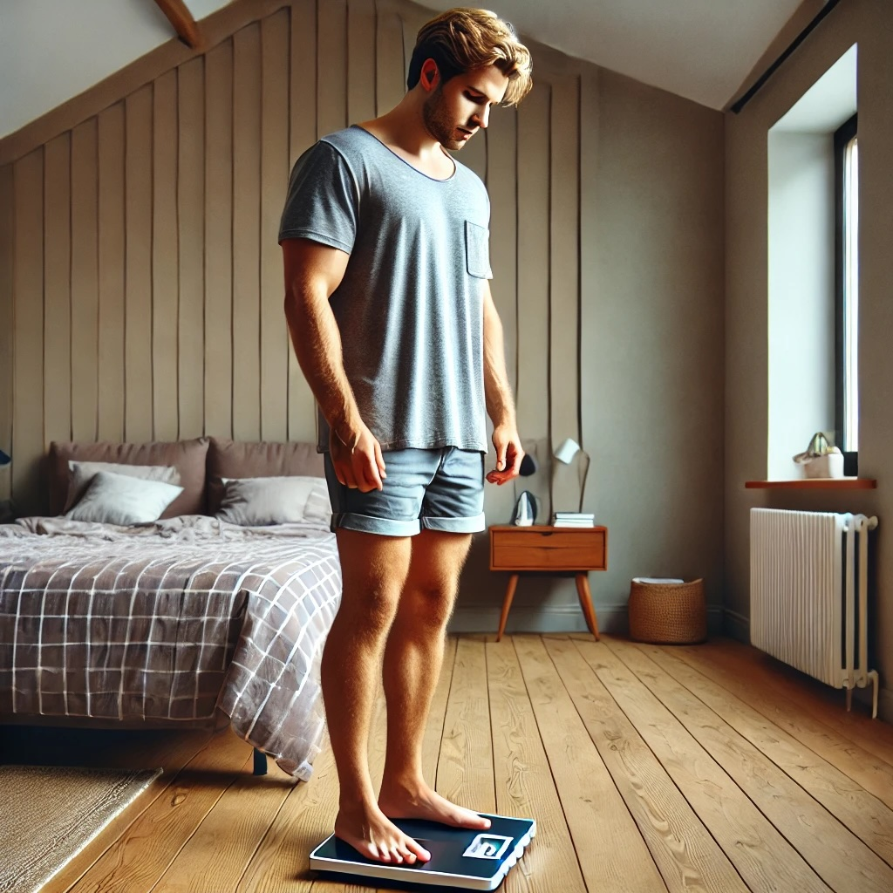
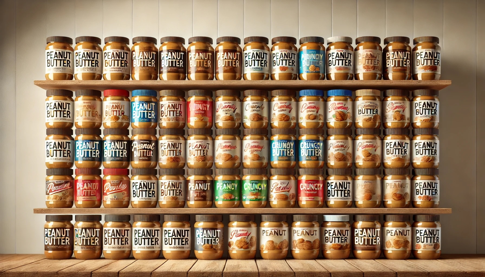

I have been riding the wave of AI since [ChatGPT](https://openai.com/index/chatgpt/) became a thing in November 2022. I didn't fully understand it, but I was immediately impressed by its ability to summarize text. That was cool, for sure, but I couldn't figure out what all of the fuss was about. 

Basically, since then, I've been continually impressed with what it can do. Most recently, Claude built me a genuinely impressive website—in just a morning. Instead of continuing to be surprised every time a new feature comes out, I thought it might be fun to imagine what the near future will be like with AI.

While there are lots of people talking about Artificial General Intelligence, I am thinking much more practical. I think most of these things probably _could_ exist now, if only we'd just build them. Not even build them, be able to integrate the disparate parts of our lives, er... the disparate technologies of our lives. 

## A Morning in the life with AI

The day starts when my alarm goes off. The funny thing is, though, that I didn't set my alarm. The alarm set itself and it knows a few things... The alarm knows that I am easily frustrated when I don't have time to get myself in order before the kids wake up - this means checking email, reading a bit, and checking my schedule. The alarm also knows that I hate being tired, so it checks my activity tracker and figures out how long I've been asleep and where in my sleep cycle I am. It then wakes me up at the best time to get started, be well rested, and finish my dreams. 

It doesn't just get me up, though. It sends my prioritized email, already devoid of the spam, the passages from my daily readers, and my schedule (with summaries of each) to my tablet. It also gives me a summary of my day the day prior, my overnight vitals (how much recovery did I get from my sleep), and makes a list of reminders I need to know to get the kids ready for school (today is pizza day and a dress down for my daughter). 

For my wife, it is the same, but she gets up earlier than I do. Her routine includes a workout. The AI knows her work out goals, preferences, and routines. Her supplements are already laid out when she comes downstairs. When she goes into the basement, the workout is already selected from the Peloton app and queued for her to begin. 

Feeling ready for the day, I get up and get moving. I weigh myself, which the AI records for me (with a small admonishment - I am over my goal for the day). When I walk downstairs, a few things have already been prepared for me. Frozen waffles have been shuffled to the top of the freezer - all I have to do is put them in the toaster. Since these are the last two waffles and that is all my kids will eat, new waffles have been added to the next grocery pick up later that afternoon. The coffee has already been brewed and is being poured into a cup for me as I enter the kitchen. The coffee is right next to a fresh cup of water and my morning vitamins. 

My son comes in and grabs his waffle. Anticipating that he'll ask for a yogurt, too, the AI has one ready in the front door of the fridge for him. My daughter hates to wake up... As such, the AI is playing her favorite song, gently shaking the bed, and turning up the heat in her room to get her moving. When I finally come up to check on her, she has begrudgingly gotten out of bed and started to get dressed... this is much better than her refusing me for 15 minutes while my son yells at me for his breakfast. 

Seeing that she has gotten up and that my son has started getting himself dressed, I hop into an already heated shower. I walk out and my clothes are already chosen for me based on my schedule and preferences. I get dressed and go back downstairs.

All that is left is to get my kids to get their shoes on and brush their teeth while I pack the food for their lunches, already chosen and set aside (again by the fridge), into lunch boxes and backpacks. We hop in the already warmed car, which has my daughter's favorite music now playing there (little does she know that I've instructed the AI to make sure it is going, so as to keep the moodiness level low). The AI has also already checked the traffic on our route to school. I continue to read, because of course the car is self driving, and off we go!

## Why will this happen?

It comes down to convenience. I don't want to think about breakfast, groceries, or even my wake-up time. Let AI handle these everyday tasks, so I can focus on family, health, and meaningful work.

The stakes are high, though... All of these decisions have to happen smoothly in the background - it will be annoying to have 27 cans of peanut butter and no jelly. It will be annoying to be incorrectly awoken too early or late. It will be annoying when the washing machine adds bleach instead of laundry detergent. Long story short, it has to make the easy things easier to allow me to handle the hard things without distraction. 

While I am an early adopter, the greater population will get in, too, when it becomes harder to NOT adopt the new technology. There will be naysayers. There will be luddites. But those people have always been with us. The technology will come and will make our lives easier. 

None of these things are earth shattering. 

Will you begin building your hardware in anticipation of this future? 

Will you begin making the software to support this? 