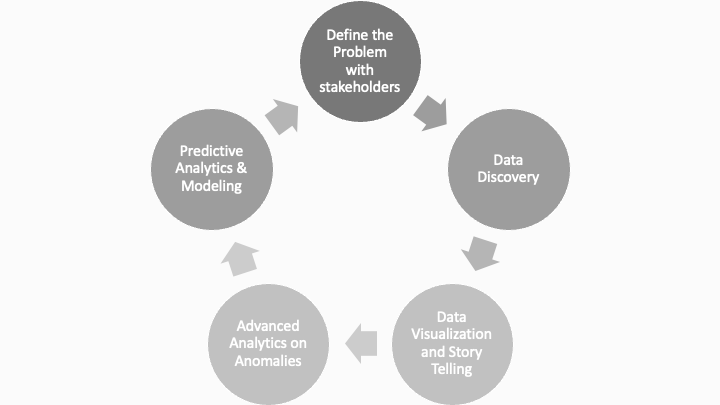

If you search for data science or data scientist, you get a lot of 
[pretty Venn Diagrams](https://www.google.com/search?q=data+science+venn+diagram)
or [cool infographics](https://www.google.com/search?q=modern+data+scientist) 
that happily point out that this is a multidisciplinary field that includes 
statistics, problem solving, computer science and engineering, data 
visualization, communication, and domain expertise.  

Beyond those graphics in your search, you will find dense articles, blog posts, 
and flashy ads about the latest machine learning (ML) or artificial 
intelligence (AI) tools and the custom fitted hardware to enable them. Hell, even 
Apple's newest models of iPhone have custom hardware and AI built into them. 

While I have spent a lot of time working on all of the skills above and trying 
to digest and enjoy some of the new hotness in ML and AI, I think that this 
tends to make data science less approachable and confuses people about what data 
science really is all about.

**In the end, data science is about finding data supported answers to real problems.** 
While sometimes it does seem enticing (and it certainly can seem 
impressive on a resume or in talking to your friends, family, and strangers) 
to jump straight to the bleeding edge of the data science spectrum, 
data science is a long and iterative path. 

Very generally speaking, data science is issue discovery, data discovery, data 
visualization and story telling, advanced analytics, testing and predictive 
analytics, and ethics (stop at any step if and when it makes sense; repeat a 
step if necessary).

# SO... WHAT IS DATA SCIENCE? 

## DATA SCIENCE IS ALWAYS ITERATION AND COMMUNICATION

To begin with, data science is 
inherently an communicative process. A data scientist must be in constant 
communication with the relevant stakeholders. This can be the executive asking 
questions, the DBA who knows the data best, the customer who is being affected 
by your model's decision, the person who was handed a copy of your presentation 
from 6 months ago, etc. In effect, a data scientist works for all of these 
people and needs their input to be successful. 

Also, as you learn about the problem and data while progressing through the 
lifecycle, you may need to go back a step (or more) and update (again). 

## DATA SCIENCE IS ALWAYS ISSUE DISCOVERY

It is easy to ask a question: "How many users do we have on our platform?" or 
"What should we expect in sales for this holiday season?" 

A data scientist must understand the nuance to the question and the context in 
which the question is being asked. For the first question posed above: What type 
of users? Web users? Active users? If it is active users, active since when? 
Paying Customers? Anyone who has ever logged in? You get the point. 

Once you have clarified the question (which requires iteration with your 
stakeholders), zoom out. Why is this person asking that question? What are they 
going to do with that information? Is it worth it to spend a ton of 
effort on it? This all informs how to tackle the problem and the lens through
which to look at the data. 

## DATA SCIENCE IS ALWAYS DATA DISCOVERY

There is no data science without data. 

However, the data is never what you are expecting. The real world is messy and 
so too is the data. There will be nonsensical values, missing values, duplicate 
values, etc. Data changes over time and is sometimes in weird formats. 

Data scientists cannot proceed without a comprehensive understanding of the 
data. This is a collaborative process and typically results in more questions 
for issue discovery. The hope is to proceed from this set with a viable dataset. 
Sometimes, though, you cannot proceed because the data is not usable. 

## DATA SCIENCE IS MOST OF THE TIME DATA VISUALIZATION AND STORY TELLING

Taking raw data and turning it into insight is pivotal for data science. Once 
the data scientist discovers an insight, though, she has to communicate that 
outwards. 

In this regards, data science is a process of being very thoughtful about the 
message and the best way to convey it. This comes in the form of presentations 
and dashboards using words, tables, charts, and graphs. Beyond this, data 
science is simplifying complex analysis into consumable pieces for the relevant 
stakeholders. 

Side note: Data science is NOT pie charts or 3d effects. Period. 

## DATA SCIENCE IS OFTEN ADVANCED ANALYTICS

It is rare that a data scientist will get through the data discovery and story 
telling steps without anomalies popping up. Investigating these anomalies and 
other quirks is often referred to as advanced analytics. These often turn into 
their own presentations and dashboards, too.

## DATA SCIENCE IS SOMETIMES TESTING AND PREDICTIVE ANALYTICS

One prerequisite to this step is having a good baseline understanding of the 
area in which you are trying to model. How do you know if your model is 
improving anything if you've never measured it before? 

Predictive analytics _can_ be cool stuff, like random forests, GBM, neural 
networks, but regression is often easier to implement and better to understand. 
It is usually best to start small and do tests to see if your prediction moves 
the needle in a meaningful way.

Prediction comes in a lot of flavors: in marketing you are trying to predict 
who is the most apt to buy your thing; in credit and finance you are predicting 
who will (or won't) pay you back; in computer vision, you are predicting what an 
object is. 

## DATA SCIENCE IS ALWAYS ETHICS

It is not in the lifecycle diagram, but it really should be. The hard part about 
adding it is that it needs to live at every step of the process. Data scientists 
often get access to sensitive data and are asked to make powerful tools that 
affect real people in real ways. Knowing what your outputs are being used for 
and why they are being used is necessary to start, then knowing when that 
crosses an ethical boundary (and speaking up). We all come with our biases and 
need to make sure we are not propagating them through our work - it is very easy 
in data science to forget this.

Use data for good. Primum non nocere. First do no harm.

# SO... WHAT IS DATA SCIENCE? 

Data science is a lot of things, but primarily it is problem solving. It fits 
within every business unit and in every industry. Many people are doing data 
science every day, and have been for a long time! 

Please... let me know how I can help!